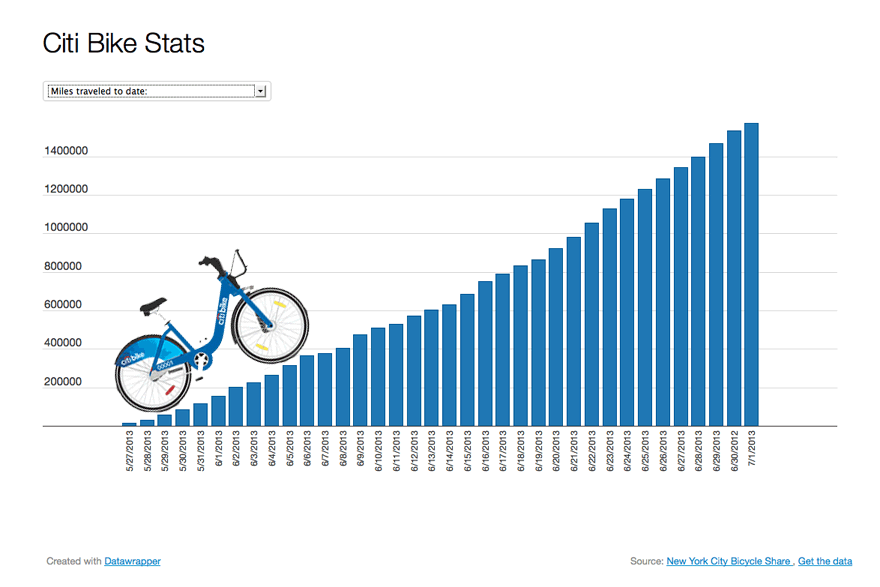

# Citi Bike Analysis With tableau

For this project I was tasked with overseeing the largest bike sharing program in the United States. My job was to generate a report for city officials looking to publicize and improve the city program. Since 2013, the Citi Bike Program has implemented a robust infrastructure for collecting data on the program's utilization. Through the team's efforts, each month bike data is collected, organized, and made public on the Citi Bike Data webpage. However, while the data has been regularly updated, the team has yet to implement a dashboard or sophisticated reporting process. I built out a story in tableau filled with dashboards to answer the questions below.

Story can be found here: 
https://public.tableau.com/profile/chandler.gibbons#!/vizhome/city_bike_analysis_whole_2_16188025479920/Story1?publish=yes

SLIDE 1: 

Interactions: Start Time Slider, Month Check List, Highlight Areas On The Map

Analysis: Overall Peak hours for the winter are between 2PM and 6PM. For this I excluded October. November peaks at 5PM, December peaks at 4PM, January peaks at 3PM, February peaks at 4PM, March Peaks at 5PM. The patter here follows that of day light during this time of year.

SLIDE 2: 

Interactions: Drop Down For Birth Year

Analysis: Looking at how average trip duration changes based on age you can see that there is a slight increase in ride time for those born 1996 - 2005 You can also see this for a few birth years in the 1940's and in 1969

SLIDE 3:

Analysis: This is a breakdown of average trip duration by generation. Looks like our generation ranking of longest ride average goes Gen Z - 18.5min, Gen X - 16.93min, Millennials - 15.81min, and Baby Boomers - 14.76min. The overall difference is just within a few minutes.

SLIDE 4:

Interactivity: Select by Station Drop Down Or By Lassoing A Section Of The Map

Analysis: During the period of October 2020 - March 2021 over 9 Million trips were recorded with the most occurring in October and November of 2020. Over all Trips die down as you move across this time period with an exception between January and February's numbers by 6415 trips.

SLIDE 5:

City Official’s Visual ADVANCED

Interactivity: An Option To Scroll Through Time By Month a Drop Down To Select By Year And Scroll Bar to Limit By Station Popularity

Analysis: As to be expected the Manhattan area is where the most trip starts are occurring. This is most likely due to its tourism and density overall. This can be seen every month throughout the data set period. As you filter down the dataset you will find that all the top stations are not in one place, but rather different zip codes clustered around the Manhattan area.

SLIDE 6:

City Official’s Visual ADVANCED

Interactivity: An Option To Scroll Through Time By Month a Drop Down To Select By Year And Scroll Bar to Limit By Station Popularity

Analysis: As to be expected what goes out must come back in. for the most part start, and finish popularity are similar. Once again likely due to its tourism and density overall of the Manhattan area. This can be seen every month throughout the data set period. As you filter down the dataset you will find that once again in virtually the same locations, all the top stations are not in one place, but rather different zip codes clustered around the Manhattan area.

SLIDE 7:

Interactions: A Playable Timeline / Drop Down By Month

Analysis: Overall both short term customers and annual subscribers decrease dramatically throughout the data set period. In March the consumer base flips to more short-term customers that subscribers. Perhaps the uncertainty of the pandemic as well as the weather have deterred folks from riding bikes outdoors during this period.

SLIDE 8: 

Analysis: Based on the graphs you can see that allot of riding on these bikes occurred in October. It may be a good idea to do maintenance before October to prep for this period. Then check again around February when the riding dies do due to weather. As for the bikes themselves, the data shows both the top 25 bikes with the longest total ride time and the bikes with the most rides. These I would be fixing first. As you will see in the next dashboard there are allot more in this relative range of hours in use.

SLIDE 9: 

Interactions: Slide Bar To Adjust Hours In Total Ride Time

Analysis: Here is your full scope look at bikes and their total ride time during the period. There are quite a few bikes that spend allot of time in use. In the category of bikes over 400 + hrs. alone there are 92 total. Roughly 757 bikes in the 300 -400 hr range and roughly 1718 in the 200 - 300 hr range. It may be worth looking into when, from a total hrs in use standpoint, the bikes tend to break down and set up a plan to service the bikes

